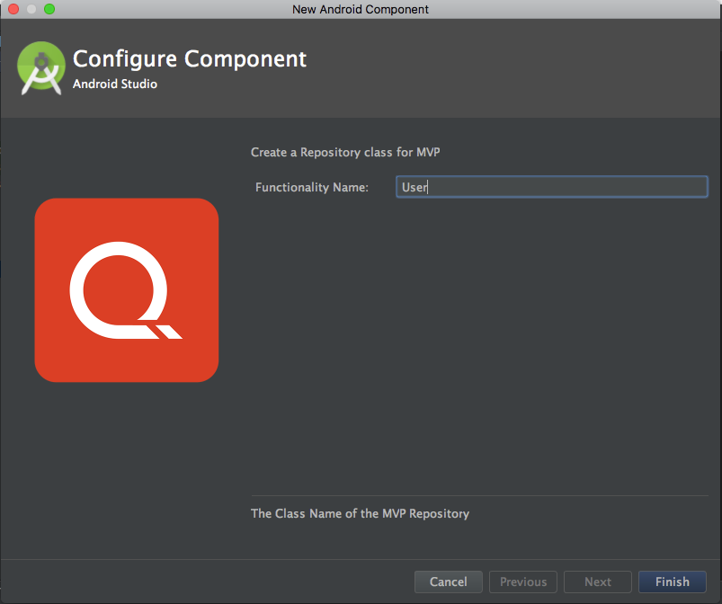

# MVP-Templates-for-Android-Studio
MVP template for Android Studio, to create a set of files for MVP functionality.
It contains 2 templates below :


#### 1. MVP Core Features Templates
This template will generate core MVP classes and and options to include a base class mvp and core class activity.


The hierarchy of generated class:
```
com.your.app      <- Cursor
    +-- featurename
    |   - FeatureNameActivity   <- Generated if include activity class checked
    |   - FeatureNameContract
    |   - FeatureNameFragment
    |   - FeatureNamePresenter
    +-- bases     <- Generated if include a base classes checked
    |   - BaseActivity    
    |   - BaseFragment   
    |   - BasePresenter     
    |   - BaseView    
```


#### 2. MVP Repositories Templates
This template will generate MVP repositories pattern.



The hierarchy of generated class:
```
com.your.app      <- Cursor
    +-- FeatureName
    |   +-- source
    |         +-- local
    |               - FeatureNameDataLocal
    |         +-- remote
    |               - FeatureNameDataRemote
    |   - FeatureNameDataSource
    |   - FeatureNameRepositories
```

Currently we are using this pattern to connect between mvp core class and repository
``` 
                                                              -----> Local
                                                            /
      Fragment  <-----> Presenter <-------> Repository <----
                                                            \
                                                              -----> Remote
```


# Installation
#### For Mac:

- Easy installation:

Run the install script at the root of this repository:

```
./install.sh
```

- Manual installation:

Copy all directories `MvpCoreFeatures` and `MvpRepositories` to

`/Applications/Android Studio.app/Contents/plugins/android/lib/templates/other/`

#### For Windows:

Copy all directories `MvpCoreFeatures` and `MvpRepositories` to 

`$ANDROID_STUDIO_FOLDER$\plugins\android\lib\templates\other\`


# Accessing templates

- Go to File -> New -> MVP in Android Studio
- or you can right click on any package, select new and choose the mvp template from there
- Command + N from any package


